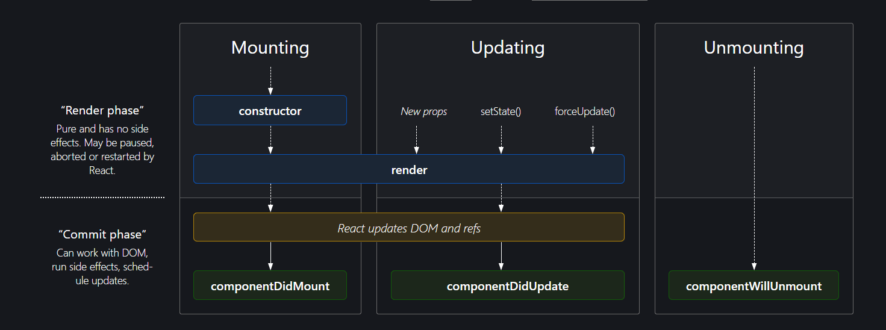

# About NPM 
npm - everything except Node Package Manager

It is a package manager for the JavaScript programming language and the default package manager for Node.js. npm is used to manage and distribute packages, which are reusable chunks of code or libraries that can be easily integrated into your JavaScript projects.

# What are Web Application Bundlers? 
--> A web application bundler is a tool that simplifies the process of ***managing and optimizing the various assets*** and resources used in a web application. These assets can include JavaScript files, CSS stylesheets, images, and other types of files. The primary goals of a bundler are to ***improve performance, reduce load times, and streamline the development and deployment workflow.***

Here are key features and functions of web application bundlers:

### ***Dependency Resolution:***
Bundlers analyze the dependencies within your project, including JavaScript modules, CSS imports, and other resources. They create a dependency graph to understand the relationships between different files.

### ***Bundle Creation:***
The bundler combines multiple files and dependencies into a single or a few bundles. This reduces the number of HTTP requests required to load a page, which can significantly improve loading times.

### ***Code Splitting:***
Some bundlers support code splitting, a technique that allows developers to split their code into smaller chunks. These chunks are loaded dynamically, improving initial page load times and enabling more efficient use of resources.

### ***Minification:***
Bundlers typically minify JavaScript and CSS files by removing unnecessary characters, whitespace, and comments. Minification reduces file sizes, making them quicker to download and improving overall performance.

### ***Transpilation:***
Bundlers often integrate with transpilers like Babel to convert code written in newer JavaScript versions (ES6, ES7, etc.) into an older version (ES5) that is compatible with a broader range of browsers.

### ***Asset Optimization:***
Web application bundlers may optimize other assets, such as images, by compressing them or converting them to more efficient formats.

### ***Source Maps:***
Bundlers can generate source maps, which provide a mapping between the original source code and the bundled, minified, or transpiled code. This aids in debugging and error tracking.

### ***Hot Module Replacement (HMR):***
Some bundlers support HMR, a feature that allows developers to see changes instantly without a full page reload during development. This speeds up the development process.

### Popular web application bundlers include:

- Webpack: A powerful and flexible bundler that supports a wide range of configurations and plugins. It is widely used in the JavaScript ecosystem.

- Parcel: A zero-configuration bundler that simplifies the setup process and provides a fast and efficient build system.

- Rollup: A module bundler designed for JavaScript libraries, but it can be used for applications as well. It focuses on creating smaller bundles.

- Browserify: An older bundler that primarily focuses on bundling JavaScript modules and making them compatible with the browser.

install parser - *npm install -D parcel*  
all the code of parcel and its dependencies are downloaded in node_modeuls folder

[parcel documentation](https://parceljs.org/)

# Parcel
- Dev Build
- Local Server
- HMR = Hot Module Replacement
- File Watching Algorithm - written in C++
- Caching - Faster Builds
- Image Optimization
- Minification
- Bundling
- Compress
- Consistent Hashing
- Code Splitting
- Differential Bundling - support older browsers
- Diagnostic
- Error Handling
- HTTPs
- Tree Shaking - remove unused code
- Different dev and prod bundles

 

### Config-driven UI 
All the UI is driven by config, the data is the config.
The UI which is displayed is driven by the data coming from backend.
We cannot build different food delivery app for differnt cities or countries.  
Eg.: different background for Delhi, Mumbai. 
     differnt cards for different cities.

#### Two types of Export/Import

- Default Export/Import
 
     export default Component ; 
     import Component from "path";

- Named Export/Import

     export constant Component; 
     import {Component} from "path"

#### Whenever state variable updates, the react rerenders the components 
- state variables are super powerful variables 
- react is good at DOM manipulation

## What is React Fibre?

React Fiber is a set of internal algorithms and data structures introduced in React 16 to improve the way React handles the reconciliation of the virtual DOM. The virtual DOM is a concept in React where changes are first made to a virtual representation of the DOM before being applied to the actual DOM. This allows React to efficiently update the user interface by minimizing direct manipulations of the real DOM.

React Fiber is designed to make the reconciliation process more flexible and incremental. The term "Fiber" refers to a unit of work in React's reconciliation process. Instead of completing the entire reconciliation in one go, React Fiber allows work to be done in smaller chunks or fibers, allowing interruptions for other high-priority tasks like user input or animations.

## What is Reconciliation Algorithm?

Reconciliation in React refers to the process of updating the user interface to reflect changes in the underlying data or state of a React application. When there's a change in the application state, React compares the new representation of the user interface with the previous one and determines the most efficient way to update the actual DOM. The goal is to minimize the number of DOM manipulations to improve performance.

React achieves reconciliation through a virtual representation of the DOM, often called the "virtual DOM." Instead of directly manipulating the real DOM, React first creates a virtual representation of the UI in memory. When the state of the application changes, React generates a new virtual DOM representation. It then compares the new virtual DOM with the previous one, identifying the differences (or "diffing" the virtual DOMs).

Once the differences are determined, React calculates the most efficient way to update the actual DOM to reflect these changes. This process is known as the "reconciliation algorithm."

#### Key points about reconciliation in React:
- Virtual DOM: React maintains a lightweight, in-memory representation of the DOM. Changes are first made to this virtual DOM before being applied to the real DOM.

- Efficiency: The reconciliation algorithm aims to update the DOM efficiently by only making the necessary changes. It calculates the minimum number of operations needed to transform the current UI into the desired UI.

- Component Re-rendering: React compares components in the virtual DOM to decide whether to update, add, or remove them in the real DOM. If a component's state or props change, React will typically re-render that component and its children.

- Keys: The use of keys in React helps the reconciliation algorithm to identify components uniquely. This is crucial for React to accurately determine which components need to be updated, added, or removed.

## What is HMR? 
HMR stands for "Hot Module Replacement," and it's a feature that allows developers to update parts of their application in real-time without requiring a full page reload. In the context of React and other JavaScript frameworks, HMR can significantly improve the development experience by speeding up the feedback loop during the development process.

When you make changes to your React code while HMR is enabled, the modified modules are swapped in and out of the running application without losing the current state. This means you can see the results of your changes instantly, and any state or variables that are currently in memory are preserved.

#### Here's a brief overview of how HMR works in React:
- Detecting Changes: A tool or a module bundler, such as Webpack, watches your project files for changes.

- Replacing Modules: When a change is detected, the updated modules are replaced in the running application without a full page reload.

- Preserving State: HMR is designed to preserve the application state as much as possible. React components and their state are kept intact during the module replacement process.

- Fast Feedback Loop: HMR provides a faster development feedback loop by eliminating the need to manually refresh the page after each code change.

HMR is a powerful tool, it's primarily intended for use in development environments and should not be used in production builds.

## Class-based component life-cycle

